<p align="center">
  <h1 align="center">🌊 EchoSign</h1>
  <p align="center">
    <strong>The Offline Trust Layer for Disaster Zones</strong>
  </p>
  <p align="center">
    
    
    
    
    
  </p>
  <p align="center">
    <em>CXC 2026 AI Hackathon</em>
  </p>
</p>

---

## 💡 The Why

When a hurricane knocks out cell towers, your $1,000 smartphone becomes a brick. First responders lose coordination. Victims can't call for help. Looters exploit the chaos because no one can verify who's who.

**EchoSign turns any smartphone into a cryptographically secure, air-gapped emergency terminal.** It uses Generative AI to compress complex emergency reports into tiny acoustic packets and Solana cryptography to verify identity — all without the internet.

> In a blackout, the last thing standing is sound. We built on that.

<p align="center">
  
  &nbsp;&nbsp;
  
</p>

---

## 🔬 How It Works

EchoSign's pipeline has five stages: **Encode → Sign → Transmit → Decode → Sync**.

### The Secret Sauce

1. **🧠 Semantic Compression (Gemini)** — We don't send raw text. Google Gemini distills a 200-word emergency report into a structured 24-byte hex code. That's ~99% compression — enough to transmit over the worst channel imaginable.

2. **📡 The Acoustic Air Gap** — The 24-byte code is transmitted as FSK (Frequency-Shift Keying) audio tones from one device's speaker to another's microphone. It works over analog walkie-talkies, PA systems, or just room air. No Bluetooth. No Wi-Fi. Just physics.

3. **🔐 Offline Trust (Ed25519)** — Every message is signed offline using Ed25519 (Solana's native cryptography). The receiver verifies the sender's identity instantly, with zero network calls.

4. **🔍 AI Classification** — Gemini auto-classifies each incident (FIRE-STRUCTURAL, FLOOD, MEDICAL) with confidence scores and priority levels for triage.

5. **⛓️ Immutable Audit (Solana)** — When connectivity returns, verified logs sync to Solana Devnet via the SPL Memo program — creating a censorship-resistant, publicly verifiable history of the disaster.

```mermaid
sequenceDiagram
    participant V as 🆘 Victim
    participant S as 📱 Sender Device
    participant AI as 🧠 Gemini AI
    participant Air as 📡 Air Gap (Sound)
    participant R as 📱 Receiver Device
    participant Chain as ⛓️ Solana Devnet

    V->>S: Speak or type emergency report
    S->>AI: "Fire in east wing, many injured"
    AI-->>S: Structured fields → 24-byte hex code
    S->>S: Ed25519 sign (offline)
    S->>Air: FSK audio tones (speaker 🔊)
    Air->>R: Microphone capture 🎙️
    R->>R: Goertzel decode → verify CRC-16
    R->>R: Verify Ed25519 signature
    R->>AI: Reconstruct human-readable alert
    AI-->>R: "FIRE — Sev 7/9 — East Wing — Many injured"
    R->>R: Auto-classify: FIRE-STRUCTURAL (95%)
    Note over R,Chain: When internet returns...
    R->>Chain: Sync verified log (SPL Memo)
    Chain-->>R: ✅ tx confirmed, immutable record
```



---

## 📐 Protocol Specification

The 24-byte wire format packs a complete emergency alert into the smallest possible representation:

| Bytes | Field | Encoding |
|-------|-------|----------|
| `0` | Alert type | Enum — SOS, Medical, Fire, Flood, Earthquake, Evacuation, Rescue, etc. |
| `1` | Severity | Integer 1–9 (1 = minor, 9 = catastrophic) |
| `2–4` | Latitude | uint24 big-endian → `(lat × 10000) + 900000` |
| `5–7` | Longitude | uint24 big-endian → `(lon × 10000) + 1800000` |
| `8` | Population | Upper nibble, log₂ scale |
| `9–16` | Message | 8 ASCII chars, aggressively abbreviated (e.g., `TRAPPED`, `RISINGWT`) |
| `17–18` | CRC-16 | CCITT-FALSE checksum over bytes 0–16 |
| `19–23` | Reserved | Zeroed — future extensions |

**Full transmission frame:** 120 bytes → 24B code + 64B Ed25519 signature + 32B public key.

**Audio transport:** 16-frequency FSK (1000–4000 Hz, 200 Hz spacing). Each nibble = one tone. 100ms tone duration, 20ms silence gap, 4-cycle preamble for synchronization, Hann-windowed Goertzel detection on receive.

---

## 🏗️ Tech Stack

| Layer | Technology | Why |
|-------|-----------|-----|
| **Frontend** | React, Vite, Tailwind CSS | Fast mobile-first UI with dark/light modes |
| **Audio Engine** | Web Audio API (Oscillators + AnalyserNodes) | Real-time FSK modulation/demodulation in the browser |
| **AI / Compression** | Google Gemini 2.5 Flash | Semantic field extraction, alert reconstruction, incident classification |
| **Voice Interface** | Google Cloud STT & TTS | Hands-free operation for injured responders |
| **Cryptography** | `@noble/ed25519` | Offline message signing — no network needed |
| **Blockchain** | `@solana/web3.js`, SPL Memo Program | Immutable on-chain audit log (Devnet) |
| **Backend** | Node.js, Express | API proxy for Gemini keys, incident management |
| **Tooling** | pnpm workspaces, TypeScript, Vitest | Monorepo with strict types and testing |

---

## 🚀 Quick Start

### Prerequisites

- **Node.js** 20+
- **pnpm** 9+
- A [Google AI Studio](https://aistudio.google.com/apikey) API key (Gemini)

### Installation

```bash
git clone https://github.com/your-username/echosign.git
cd echosign
pnpm install
```

### Environment Setup

```bash
cp .env.example .env
```

Edit `.env` and add your keys:

```env
GEMINI_API_KEY=your-gemini-api-key
SOLANA_RPC_URL=https://api.devnet.solana.com
SOLANA_KEYPAIR_PATH=./cyren-keypair.json
```

### Generate a Wallet (Rescuer Identity)

```bash
npx tsx scripts/generate-wallet.ts
```

This creates an Ed25519 keypair at `cyren-keypair.json`. Fund it for on-chain logging:

→ [https://faucet.solana.com](https://faucet.solana.com)

### Run It

```bash
# Terminal 1 — API server (port 3001)
pnpm dev:server

# Terminal 2 — Web UI (port 5173)
pnpm dev:web
```

Open [http://localhost:5173](http://localhost:5173).

### Demo Walkthrough

1. **Report** — Press the big "Push to Report" button to speak, or type an emergency message below it
2. **Submit** — Hit "Submit Report" — Gemini encodes it into a 24-byte hex code and auto-classifies the incident
3. **Transmit** — Press "Transmit Audio" to play the FSK tones through your speaker
4. **Listen** — On a second device (or tab), go to **Alerts** and start listening. Stop to decode the signal, verify the CRC, and reconstruct the alert via Gemini
5. **Ledger** — Check the **Ledger** tab to sync verified alerts to Solana Devnet

---

## 📁 Project Structure

```
packages/
├── core/       Semantic codec — pack/unpack 24-byte codes, Gemini encode/decode, CRC-16
├── acoustic/   FSK modulation & Goertzel demodulation (Node.js)
├── web/        React + Tailwind frontend — mobile-frame UI with Web Audio API
├── server/     Express API — encode, decode, STT, TTS, incident management
├── solana/     On-chain audit logging via Solana Devnet memo program
├── speech/     Speech-to-text / text-to-speech types and config
└── cli/        Command-line interface for headless encode/decode/transmit
```

---

## 🏆 Prize Track Alignment

| Track | How EchoSign Fits |
|-------|------------------|
| **Best Use of AI for Good** | Disaster relief communication when all infrastructure is down |
| **Best Use of Gemini** | Using LLMs for *semantic compression*, not chatbots — 200 words → 24 bytes |
| **Best Use of Solana** | Offline Ed25519 identity + on-chain immutable audit trail |
| **Best Audio Hack** | Custom 16-frequency FSK modem with Goertzel decoding in the browser |

---

## 🔧 Troubleshooting

| Issue | Fix |
|-------|-----|
| **Microphone not working** | Browser requires HTTPS for mic access. Use `ngrok http 5173` or `localhost`. Check browser permissions. |
| **"Permission denied" for GPS** | GPS is optional — the app works without it. Gemini infers location from message text. |
| **Solana transaction fails** | Fund your wallet at [faucet.solana.com](https://faucet.solana.com). Devnet SOL is free. |
| **Gemini 429 rate limit** | Built-in retry with exponential backoff (4s, 8s, 12s). Wait a moment and retry. |
| **FSK decode errors** | Ensure minimal background noise. Hold devices 0.5–2m apart. Check that speaker volume is above 50%. |

---

## 📄 License

[MIT](LICENSE)

---

<p align="center">
  <strong>Built with urgency at CXC 2026.</strong><br/>
  Because when the grid goes dark, sound still travels.
</p>
